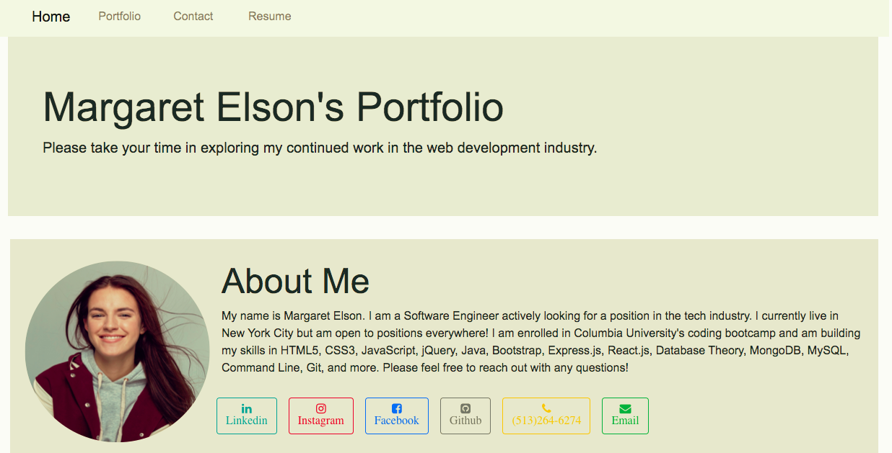
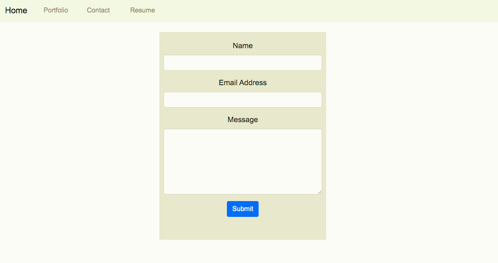
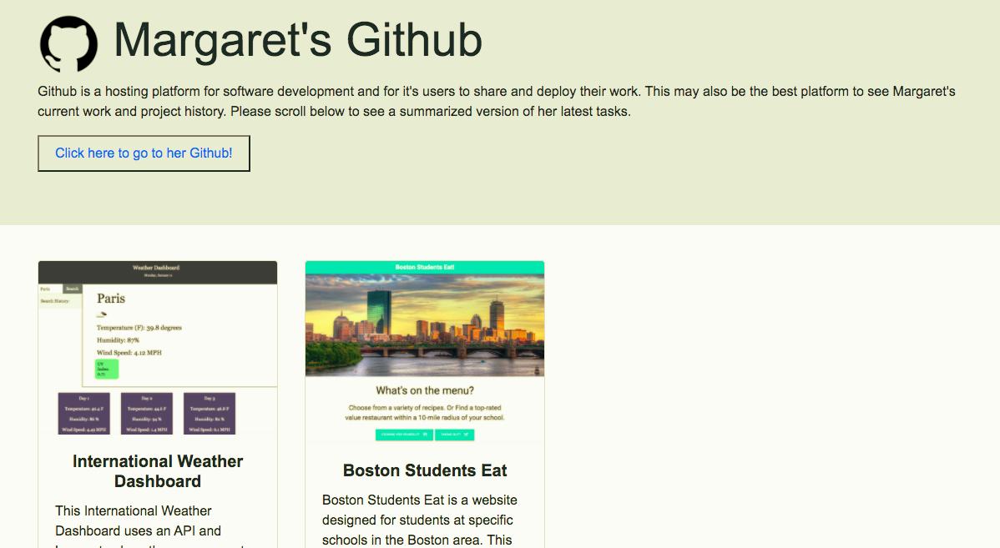
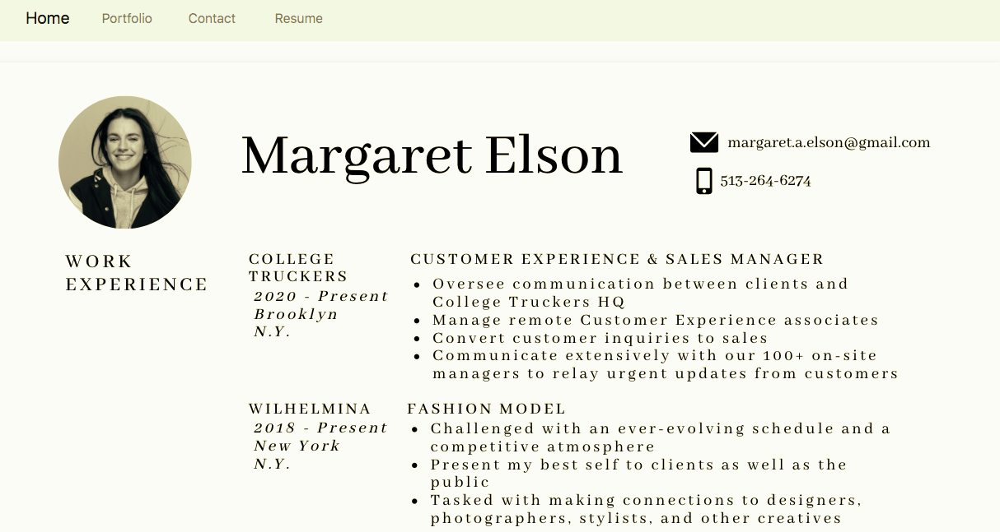

# 02 Margaret Elson's Portfolio

## Description

On this project, I created a website using HTML and Bootsrap to continually update as I continue my work in the coding industry. Using an HTML validation service, I feel confident in each of the HTML pages in this site. 

I used Bootstrap to make the layout of this website as it is. Using the Navbar at the top, the user can move from page to page to learn more about me, what is in my portfolio, and how to contact me! I would be interested to see how using JavaScript could imporve my portfolio and plan to test that out in the near future.

[Link](https://margaretelson.github.io/Portfolio/)

## Built With

The following features were used in creating this website:
* HTML
  * Semantic elements, tags
  * Attributes
* Bootstrap
* Git & Git workflow
  * git clone
  * git add
  * git commit
  * git push
  * git pull
* GitHub

## Screenshots of Site

## Installation

Use VSCode to install.

## License

MIT License

- - -
